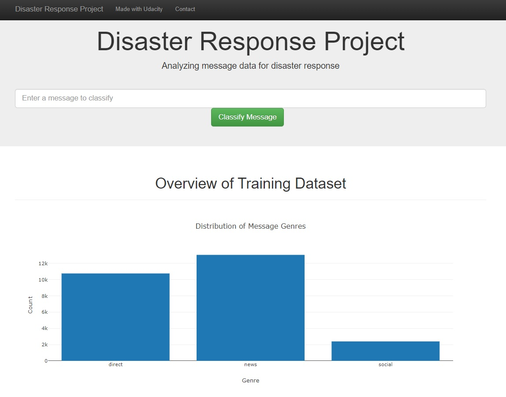
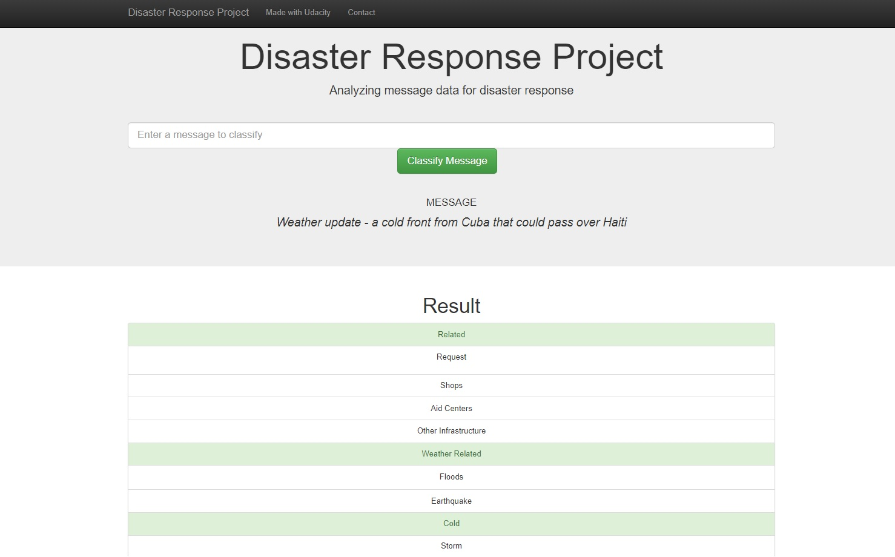

# Disaster Response Pipeline Project

### Description:

This project uses a dataset with pre-labeled tweets and text messages provided by Figure Eight describing real life disasters to learn and predict which category of disaster response professionals should be alerted about an incident.

The project is divided in the following parts:
	* ETEL pipeline to extract, clean and save the messages in a database
    * Machine Learning pipeline that builds and trains the model used to classify text message into categories
    * Web App that uses the model to classify input messages in real time

### Strucuture:
The repository contains three folders: data, models and app. 

The data folder contains the *process_data.py* file that takes as input two csv files containing the labels and messages, cleans the data and splits it into corresponding categories and then saves the output in a database. 
Along with the python source file there are the jupyter notebook and converted html version of the ETL pipeline preparation file.The output database file is present in the data folder.

The models folders contains the *train_classifier.py* file that loads the database from the data folder, builds and trains the Machine Learning model, than tests the model outputting the f1 score, precision, recall and accuracy for each category. The resulting model is saved in the folder in the *classifier.pkl* file. The ML pipeline preparation file is provided in the folder.

The app folder is divided in two parts: the html files from the templates folder and two python files that use the trained model to classify the user input and provide some visualizations over the data in the dataset.

The classification output looks like this.

### Instructions:
1. Run the following commands in the project's root directory to set up your database and model.

    - To run ETL pipeline that cleans data and stores in database
        `python data/process_data.py data/disaster_messages.csv data/disaster_categories.csv data/DisasterResponse.db`
    - To run ML pipeline that trains classifier and saves
        `python models/train_classifier.py data/DisasterResponse.db models/classifier.pkl`

2. Run the following command in the app's directory to run your web app.
    `python run.py`

3. Go to http://0.0.0.0:3001/
